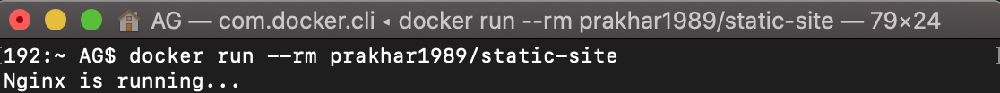
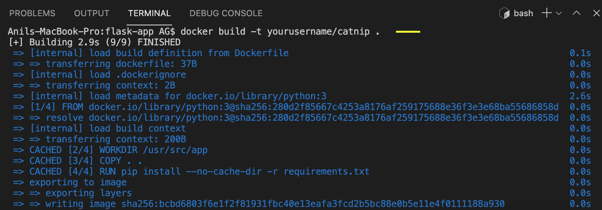
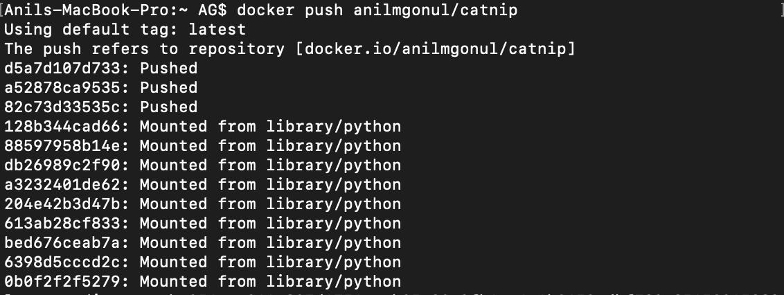

# Docker-Learning
Personal advancement progress while learning the Docker

## INTRODUCTION

### What is Docker?

Docker is a software platform that allows you to build, test, and deploy applications quickly. Docker packages software into standardized units called containers that have everything the software needs to run including libraries, system tools, code, and runtime.

### What are containers?

Containers are a solution to the problem of how to get software to run reliably when moved from one computing environment to another. This could be from a developer’s laptop to a test environment, from a staging environment into production, and perhaps from a physical machine in a data center to a virtual machine in a private or public cloud.

### Why to Use Docker?

It is simply because it makes it possible to get far more apps running on the same old servers and it also makes it very easy to package and ship programs.

### Dockerfile

It is a simple text file that contains a list of commands that the Docker client calls while creating an image.

## Getting Started with Docker

### Setting up the Computer / Environment

After installing the Docker, we can test Docker installation by running the following:


## HELLO WORLD

### Playing with BusyBox

Docker yuklenmesi ve calismasi test edildikten sonra, pratik kazanimi elde etmek adina basit bir uygulama gelistirerek Docker dunyasina girme vakti. Bu kisimda, **BusyBox** konteynerinin calistirilmasi ve buna bagli olarakta `docker run` komutu ele alinacaktir.

Bu baglamda, asagidaki komutu terminalimize yazalim:


`pull` komutu **BusyBox** imajini bizim icin getirmis oldu. Bu imaji *Docker registry* 'den  aldi ve sistemimize yukledi. Sistemimizde bu imajin yuklendigini veya var olup olmadigini gormek icin ise `docker images` komutunu kullanmamiz gerekiyor.


## Docker Run

Su ana kadar harika is cikardik ve konteynerimizi calistirma vakti. Bunu yapabilmemiz icin `docker run` komutunu kullanmamiz gerekiyor.


Hicbir sey olmamis gibi gorunse de, arka planda bir cok mekanizma harekete gecti. Oncelikle `run` komutunu kullandigimiz andan itibaren Docker client imaji buldu, ki bu busybox, ve onu konteynerimiza yukleyip calistirdi.

Ayni asamada `echo` komutunu kullanarak bazi ciktilar da gorebiliriz.


Koyteynerlarin cok hizli calismis oldugunu gormus olduk. Simdi ise yeni bir komut ogrenme zamani. `docker ps` komutu bize suan ki calisan konteyneri gosterir. Varyasyon olarak ise calisan tum konteynerlari gostermek adina `docker ps -a` komutunu kullanacagiz.


Sahip oldugumuz konteynerlari temizlemek icin kullanmamiz gereken komut `docker rm`. Bunu yaparken konteyner ID'sini kullanabiliriz. Eger ki birden fazla konteyner temizlemek istiyorsak, her bir konteyner ID'sini komutumuza ekleyebiliriz. Son versiyonda ise `docker cantainer prune` komutu da ayni islemi yapmaktadir ve tum konteynerlari temizler. Son olarak ise, ihtiyacimiz olmayan imaji silmek icin ise `docker rmi` kullanilir.


## WEBAPPS with DOCKER

### Static Sites

Bebek adimlari atmaya basladik ve Docker'i kullanarak basit statik bie websitesini nasil calistiracagimizi gorme zamani. Bu asamada Docker Hub'dan bir Docker imajini cekecegiz ve konteyneri calistirip web server'in nasil calistigini gorecegiz.

Uzerinden tekrar gecmek adina, `docker rm` ve `docker rmi` cok benzer iki komut. Basit bir dille anlatacak olursa;

> docker image rm == docker rmi

> docker container rm == docker rm

Buna ek olarak, `docker run <image_adi>` bizim icin arkada yansinin indirilmemis oldugunu kontrol edip, `docker pull <image_adi>` komutunu tetikleyip, yansi indikten sonra calistirma isine devam eder. Boylece *docker run* ile dogrudan yansiyi cekip calistirabiliriz.  

Simdi ise, `docker run` komutu ile imajimizi indirip, calistirabilir ve kullanmaya baslayabiliriz.



kullandigimiz imaj local host'da var olmadigi icin, istemci bilgisayara registry'den imaji getirmemiz ve calistirmamiz lazim. Eger her sey yolunda giderse `Nginx is running` mesajini gormemiz gerek. Boylelikle, server'in calistigini anlayabiliriz. Ancak hangi port'da calistigini ve daha onemlisi konteynera direkt olarak ana bilgisayardan nasil erisim saglayacagimizi goremiyoruz. Bunu saglamak icin ise oncelikle *Ctrl+C* yapip konteyneri durduralim ve asagidaki komutu yazalim.

```
$ docker run -d -P --name static-site prakhar1989/static-site
```

Yukaridaki komutta, `-d` detach mode'da yani arka planda calismasini saglayacak ve `-P` ise (P buyuk harf ile yazilmali) portu gosterecek, bunun haricinde, `--name` etiketi de bizim istedigimiz adi verdigimiz ismi gosterecek. Daha sonrasinda ise, `docker port [container]` komutu ile hangi port'dan baglanabilecegimizi gorebiliriz.  


Boylelikle statik sitemize buradan erisebiliriz. [http://localhost:55003/](http://localhost:55003/)


Son olarak ise, detached mode'da calisan konteyneri durdurmak icin `docker stop` komutu yeterli olacaktir. Bu komutu ister Container ID ile isterse konteynera verilen isim ile kullanasbiliriz.


## DOCKER IMAGES

Daha onceki konu anlatimlarinda Docker imajlarini gormustuk. Bu kisimda ise biraz daha detayli inceleyecegiz. Kendi imajimizi olusturarak konuyu kavramaya calisacagiz. Sonrasinda ise, olusturdugumuz imaji kullanarak lokal host'umuzda calistirarak AWS platformuna yukleyecegiz.

### Ilk Imaj Olusturulmasi

Bu calismada basit **Flask** ugulamasi kullanilacak. Uygulamanin sonunda websitesinde `.gif` haliyle bir kedi gosterilmek amaclanmistir. Baslarken, daha onceden olusturulmus *flask-app*'i github reposundan klonlayalim.

```
$ git clone https://github.com/prakhar1989/docker-curriculum.git

$ cd docker-curriculum/flask-app

```

Daha sonraki adimimiz ise bu web aplikasyonuyla imaj olusturmak.

Ek bilgi olarak, iki sekil imaj'lar bulunur; *resmi imaj(official images)* ve *kullanici imaj(user images)*. Resmi imaj'lar Docker tarafindan desteklenen resmi sekilde olusturulmus imajlardir. Ornek olarak; `python`, `ubuntu`, `busybox` verilebilir.
Kullanici imaj'lar ise resmi imaj'lari base alarak senin benim gibi kullanicilar tarafindan olusturulmus imaj'lardir.
Dolayisiyla, olusturacagimiz basit web imaj'i kullanici imaji sinifina girmektedir.

### Dockerfile

**Dockerfile** basitce bir text file olup, icinde bir cok komut barindirir. Basit bir sekilde imaj olustururken kullanabilecegimiz  bir otomasyondur. Dockerfile'da kullandigimiz komutlar neredeyse Linux komutlariyla birebir benzerlik gosterir. Baslarken, text-editor'umuzde ayni klasor icerisinde bos bir dosya olusturalim ve `Dockerfile` olarak adlandiralim.


`Dockerfile` hazir ve imaj olusturmasina rahatlikla baslayabiliriz. Bu asamada `docker build` komutu gerekli islemleri bizim icin gerceklestirecek.

```
$ docker build -t yourusername/catnip .
```

`docker build` komutu kullanildiktan sonra opsiyonel olarak isim etiketi olan `-t` kullanildi ve lokasyon bilgisine yer verildi.
Buradaki *username* kismi olusturdugunuz **Docker hub** hesabinizin kullanici adiyla ayni olmalidir.



Son adimda ise,
```
$ docker run -p 8888:5000 yourusername/catnip
* Running on http://0.0.0.0:5000/ (Press CTRL+C to quit)
```
komutuyla port 5000'i kullanarak server tarafinda harici bir port'da goruntuleyecegiz.

Buradan bakabilirsiniz [http://localhost:8888/](http://localhost:8888/)


## Docker on AWS

Bu kisimda uygulamalarin bulut ortamina nasil yuklenecegini gorecegiz. Boylece, var olan uygulamayi calisma arkadaslarimizla ve kullanmak isteyenlerle rahat bir sekilde paylasabiliriz. Bunun icin ise AWS [Elastic Beanstalk](https://aws.amazon.com/elasticbeanstalk/) kullanacagiz ve bir kac adimda AWS ortamina yuklemis olacagiz.

### Docker push

Bu isleme baslamadan once olusturdugumuz imaj'i yayinlamamaiz gerekiyor. Olusturdugumuz imaj'i host edecegimiz yer  ise [Docker hub](https://hub.docker.com/) olacak.
Eger sisteme ilk defa imaj yukluyorsaniz, Docker Hub'dan oturum acilmasi gerekmektedir. Terminal uzerinden oturum acacagiz ve girdigimiz bilgilerin Docker Hub icin olusturdugumuz kredite edilmis bilgilerler ayni olmasi gerekiyor.


Olusturdugumuz imaj'i yuklemek icin ise asagidaki komutu kullanacagiz.

```
$ docker push yourusername/catnip
```
*Kendi kullanici adinizi yaziniz*



Eger her sey yolunda gittiyse, yuklediginiz imaj'i [buradan](https://hub.docker.com/r/anilmgonul/catnip/tags) gorebilirsiniz.

### Beanstalk

AWS Elastic Beanstalk sunucular uzerinde web uygulamalarini dagitip olceklendirmek icin kullanilan bir hizmettir.

Bu asamanin saglikli ilerleyebilmesi icin [AWS](https://aws.amazon.com/) hesabina ihtiyacimiz var.

Bu asamalari takip edebilirsiniz:

- Oturum acin. AWS [console](https://signin.aws.amazon.com/signin?redirect_uri=https%3A%2F%2Fconsole.aws.amazon.com%2Fconsole%2Fhome%3Ffromtb%3Dtrue%26hashArgs%3D%2523%26isauthcode%3Dtrue%26state%3DhashArgsFromTB_us-east-1_b17fce76cc29af1f&client_id=arn%3Aaws%3Asignin%3A%3A%3Aconsole%2Fcanvas&forceMobileApp=0&code_challenge=RC4khUpCiVZzIdw27pYzQoia23H0bhqADutgli6Bo0U&code_challenge_method=SHA-256)
- **Elastic Beanstalk console** secilir


- "Create New Application" secilir
- Uygulamaya *unique* isim verilir
- **New Environment** olusturulur
- Bilgiler doldurulur
- Configuration bolumunun altinda *Docker* , *predefined platform* olarak secilir


- Simdi ise uygulama kodumuzu yukleyebiliriz. Fakat, uygulamamiz Docker konteynerinda paketlendiginden sadece Elastic Beanstalk olarak bilgi sahibi olabiliyoruz.
